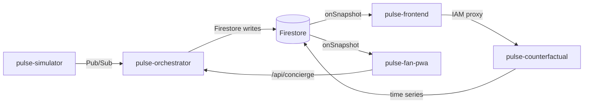

# System design

Condensed ops-view of the PULSE architecture. The full spec lives in [Idea.md §4](../Idea.md); this document is the version the on-call engineer would read.

## Five layers

PULSE is a five-layer pipeline deployed as five live Cloud Run services (a sixth — perception — is deferred) with Firestore as the real-time backbone and Pub/Sub as the inter-service event bus.

### Layer 1 — Inputs (sensor substrate)

| Source | Format | Rate | Transport |
|---|---|---|---|
| Simulated CCTV / IoT / match / fan signals | JSON events | 1–500 /s | Pub/Sub `sensor-events` |
| Vision anomalies (synthetic for now) | JSON with `severity`, `confidence` | on scripted trigger | Pub/Sub `sensor-events` |
| Fan voice queries | text + modality | per-fan, event-driven | HTTPS from fan-PWA |

### Layer 2 — Perception

A Python [simulator](../apps/simulator/) replaces the eventual Gemini 2.5 Vision service for the demo: it emits turnstile, PoS, restroom, density, and anomaly events against a scripted YAML timeline ([ipl_final.yaml](../apps/simulator/src/scenarios/ipl_final.yaml)). A future Cloud Run service will stream CCTV frames from `gs://pulse-cctv-clips` through Gemini 2.5 Vision and publish to the same topic — no agent-side changes needed.

### Layer 3 — State

- **Firestore Native** (`asia-south1`) — hot state. Collections: `/venues/chinnaswamy`, `/venues/chinnaswamy/zones/{id}`, `/venues/chinnaswamy/interventions/{id}`, `/agent_traces/{trace_id}`, `/counterfactual/{session_id}/states/{tick}`, `/demo_runs/{run_id}`. Security rules ([infra/firestore.rules](../infra/firestore.rules)) permit client READS on ops surfaces only; every client WRITE is blocked.
- **Pub/Sub** — event bus with six typed topics: `sensor-events`, `vision-frames`, `agent-events`, `fan-actions`, `staff-tasks`, `signage-updates`.
- **BigQuery** dataset `pulse_analytics` — cold store, ready for AAR streaming inserts.
- **Cloud Storage** bucket `pulse-cctv-clips` — ready for perception ingest.

### Layer 4 — Cognition (ADK)

A single FastAPI service [pulse-orchestrator](../apps/orchestrator/) holds the multi-agent logic. An ADK 1.x `LlmAgent` root (Gemini 2.5 Pro) carries five specialists (Gemini 2.5 Flash) as `AgentTool` wrappers — the Explicit Invocation pattern from [Idea.md §6.4](../Idea.md). A 5-second tick reads the zone snapshot from Firestore, composes a prompt, and lets the orchestrator sequentially invoke specialists in ONE invocation. Every invocation persists to `/agent_traces/{trace_id}` with typed inputs, outputs, tokens, cost, and duration.

### Layer 5 — Actions

- **Ops console** ([pulse-frontend](../apps/frontend/)) — Next.js 15 + React Three Fiber 3D twin with Firebase Web SDK `onSnapshot` listeners (sub-500 ms propagation). Split-screen counterfactual overlay.
- **Fan PWA** ([pulse-fan-pwa](../apps/fan-pwa/)) — installable Next.js 15 PWA, six screens, voice via Web Speech API.
- **Scripted auto-play** — a 23-event JSON timeline at [public/scripted-responses/ipl-final-2026.json](../apps/frontend/public/scripted-responses/ipl-final-2026.json) replayed client-side for deterministic zero-Gemini demo runs.

## Service topology

## Runtime identity

Single service account `pulse-runtime@pulse-stadium-ai.iam.gserviceaccount.com` with the ten least-privilege roles documented in [deployments.md](../deployments.md). Service-to-service calls mint Cloud Run identity tokens via `google-auth-library`; no key files ship in code.

## Key decisions

- **Vertex AI split region.** Gemini 2.5 Pro isn't served from `asia-south1` — compute stays in `asia-south1`, Vertex calls go to `us-central1` via `GOOGLE_CLOUD_LOCATION`. ~250 ms additional latency, invisible to the user.
- **AgentTool over sub_agents.** ADK's `sub_agents` transfers control to the specialist and ends the invocation. `AgentTool` wraps the specialist as a callable function so the orchestrator keeps control, produces a single final paragraph, and a single `/agent_traces` row captures the full `care → flow → revenue` chain.
- **Deterministic demo.** The 90-second auto-play does not touch Gemini; it replays scripted Firestore writes. `$0.00` cost per run, identical prose every time.
